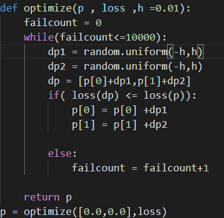
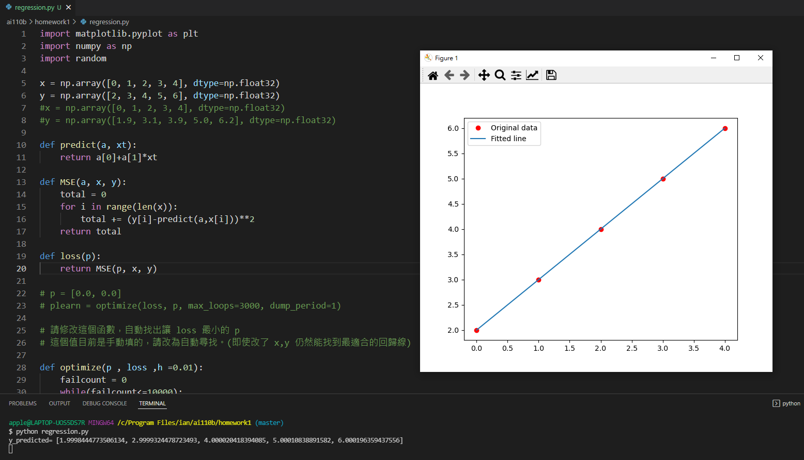
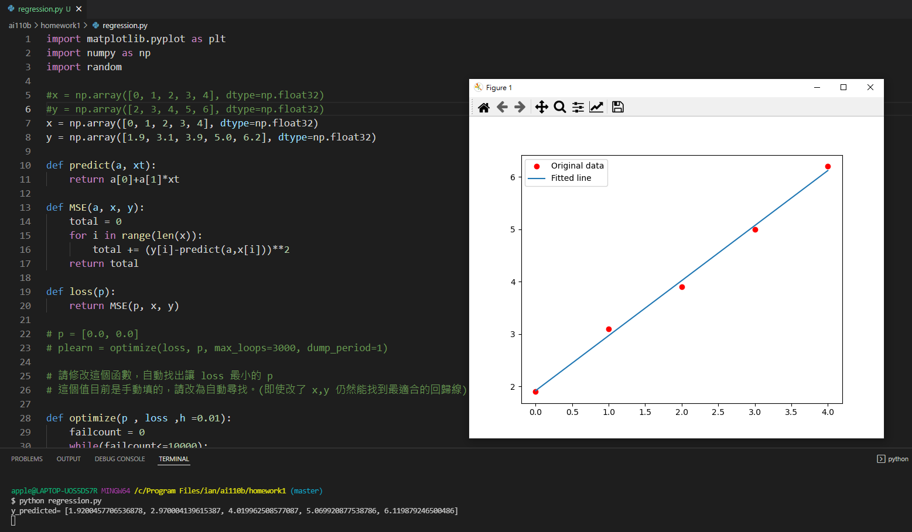

# 爬山演算法做線性回歸

* 說明 

下圖為需要修改的optimize函數，作法參考自<a href = "https://gitlab.com/ccc110/ai/-/blob/master/02-optimize/01-hillclimbing/03-var2/hillClimbing2r.py">hillClimbing2r.py</a>並改寫

 

* 
執行結果(一)
 

執行結果(二)

* 參考程式 <a href = "https://gitlab.com/ccc110/ai/-/blob/master/_homework/01-regression/regression.py">regression.py</a>
