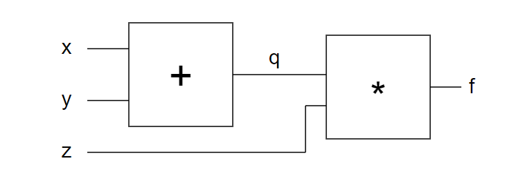
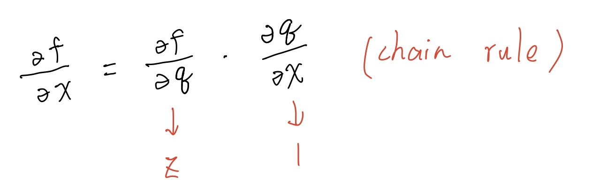
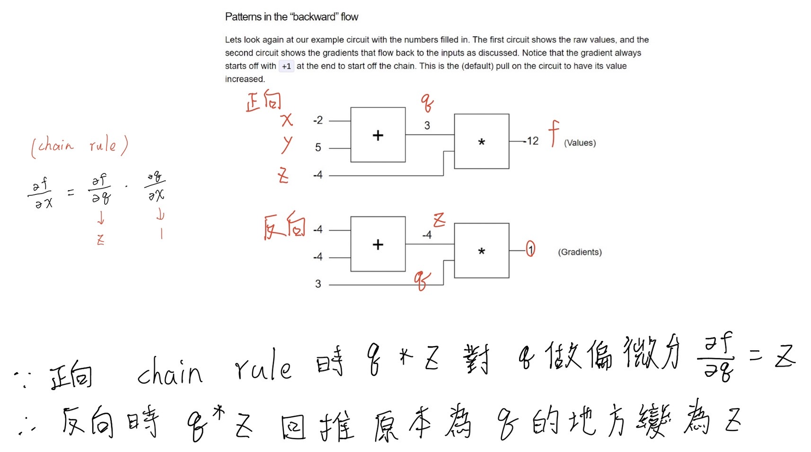

# 研究 micrograd 專案

## 說明

* 程式非本人原創，參考 <a href="https://github.com/karpathy/micrograd"> micrograd </a>，理解後在程式增加註解。

* 屬於 <a href="https://github.com/karpathy/micrograd"> karpathy </a> 的專案 以<a href="https://github.com/karpathy/micrograd/blob/master/LICENSE"> MIT License </a> 授權 

* 主要著重在 <a href="https://github.com/weiian000/ai110b/blob/master/midterm/engine.py"> engine.py </a> 與 <a href="https://github.com/weiian000/ai110b/blob/master/midterm/nn.py"> nn.py </a>  這兩個程式說明上
--------------------------------------------------
<pre>
    在深入 engine.py 以及 nn.py 前需要具備反傳遞演算法的觀念
    
    反傳遞演算法:先算一次正向，算出所有中間值，再算出所有反傳遞的梯度，在算反傳遞的梯度時需要用到偏微分。

    這邊引用同樣是karpathy的 <a href="http://karpathy.github.io/neuralnets/">文章</a> 內容做說明

    正向 x+y=q，z*q=f
    
    運用到微積分裡的鏈鎖規則
    
    反向
    

    梯度要累加，先 zero grad 再一個個累加回去，重新開始前不管 f 是多少要把梯度歸 0
    
    再開始用反傳遞算法累加梯度，再更新之前的權重。

    engine.py 主要是用來實作一些運算子(加法、乘法、x的n次方....)

    這些運算子函數，皆須使用到反傳遞演算法，因此會看到函式裡皆會做正向運算，再利用偏微分做一次反向運算計算梯度

    反向運算實一定要使用加等於因為有可能一個元素輸出給不同個再去算出結果，權重會累加。

</pre>
* <a href="https://github.com/weiian000/ai110b/blob/master/midterm/engine.py"> engine.py </a> 程式碼(含註解)
<pre>
class Value:
    """ stores a single scalar value and its gradient """

    def __init__(self, data, _children=(), _op=''):
        self.data = data
        self.grad = 0
        # internal variables used for autograd graph construction
        self._backward = lambda: None
        self._prev = set(_children)
        self._op = _op # the op that produced this node, for graphviz / debugging / etc

    def __add__(self, other): # f=x+y
        other = other if isinstance(other, Value) else Value(other)
        out = Value(self.data + other.data, (self, other), '+')

        def _backward():
            self.grad += out.grad  #  因為 f=x+y  gx微分是1 偏微分時直接乘1回來 => gx = gf，一定要使用加等於因為有可能一元素輸出給不同個再去算出結果，權重會累加
            other.grad += out.grad # 同理 gy = gf
        out._backward = _backward

        return out

    def __mul__(self, other): # f=x*y
        other = other if isinstance(other, Value) else Value(other)
        out = Value(self.data * other.data, (self, other), '*') 

        def _backward():
            self.grad += other.data * out.grad # gx = y*gf  假設f的梯度值是gf x的梯度值是 y*gf   gx/gf = y
            other.grad += self.data * out.grad # gy = x*gf  
        out._backward = _backward

        return out

    def __pow__(self, other): # f = x**n x的n次方
        assert isinstance(other, (int, float)), "only supporting int/float powers for now"
        out = Value(self.data**other, (self,), f'**{other}') #other次方是個常數

        def _backward():
            self.grad += (other * self.data**(other-1)) * out.grad # gx = n (x**n-1)  n乘上x的n-1次方
        out._backward = _backward

        return out

    def relu(self): #(以正向和負向的結果當作條件)
        out = Value(0 if self.data < 0 else self.data, (self,), 'ReLU') #正向小於0的時候就等於0

        def _backward(): 
            self.grad += (out.data > 0) * out.grad # 如果f>0 gx=1
        out._backward = _backward

        return out

    def backward(self): #當最後的正向值算出來後要一層層的往回算

        # topological order all of the children in the graph #計算順序因為要逆向回去，否則算不出來的元素先算會有問題
        topo = []#
        visited = set()#類似dfs 紀錄拜訪過的
        def build_topo(v):
            if v not in visited: #找出未被拜訪過的加入visited.add
                visited.add(v)
                for child in v._prev:#如果v 在child前一個 把他加進去
                    build_topo(child)
                topo.append(v)#topological 順序算出來後再放入topo陣列中
        build_topo(self)

        # go one variable at a time and apply the chain rule to get its gradient
        self.grad = 1
        for v in reversed(topo):#將topo倒過來
            v._backward()#算一遍後結束

    def __neg__(self): # 取-self的值
        return self * -1

    def __radd__(self, other): # other + self 加等於 +=
        return self + other

    def __sub__(self, other): # self - other
        return self + (-other)

    def __rsub__(self, other): # other - self
        return other + (-self)

    def __rmul__(self, other): # other * self
        return self * other

    def __truediv__(self, other): # self / other 
        return self * other**-1

    def __rtruediv__(self, other): # other / self
        return other * self**-1

    def __repr__(self): # 轉字串 -- https://www.educative.io/edpresso/what-is-the-repr-method-in-python
        return f"Value(data={self.data}, grad={self.grad})"

</pre>

<a href="https://github.com/weiian000/ai110b/blob/master/midterm/nn.py"> nn.py </a> 用來建構神經網路和多層感知器

* nn.py (程式碼+註解)
<pre>
import random
from micrograd.engine import Value

class Module:#定義一個模組

    def zero_grad(self):
        for p in self.parameters():
            p.grad = 0

    def parameters(self):
        return []

class Neuron(Module):#一個神經元為一個Module 

    def __init__(self, nin, nonlin=True):
        self.w = [Value(random.uniform(-1,1)) for _ in range(nin)]
        self.b = Value(0)
        self.nonlin = nonlin

    def __call__(self, x):#x表示這個值被帶入Neuron的時候會得到的值 (是一個正向運算) #計算逆向時只需要呼叫backward()
        act = sum((wi*xi for wi,xi in zip(self.w, x)), self.b)#對每一個w，x做一次wi*xi最後加上b
        return act.relu() if self.nonlin else act#將對每一個w，x做一次wi*xi最後加上b算出來的結果relu，就是一個神經元的輸出值

    def parameters(self):
        return self.w + [self.b]#self.w為一個陣列，python陣列相加是append把w跟b合起來成為一個陣列

    def __repr__(self):#轉字串
        return f"{'ReLU' if self.nonlin else 'Linear'}Neuron({len(self.w)})"

class Layer(Module): #神經元做完換做layer

    def __init__(self, nin, nout, **kwargs):#nin個輸入 ，nout個輸出
        self.neurons = [Neuron(nin, **kwargs) for _ in range(nout)] #一個Layer是一堆神經元

    def __call__(self, x):
        out = [n(x) for n in self.neurons]
        return out[0] if len(out) == 1 else out

    def parameters(self):
        return [p for n in self.neurons for p in n.parameters()]#對於所有的neurons神經元，把所有的參數集合起來

    def __repr__(self):
        return f"Layer of [{', '.join(str(n) for n in self.neurons)}]"

class MLP(Module):#多層感知器

    def __init__(self, nin, nouts):
        sz = [nin] + nouts #每一層的大小包含輸入層，中間層，輸出層
        self.layers = [Layer(sz[i], sz[i+1], nonlin=i!=len(nouts)-1) for i in range(len(nouts))]#呼叫layer把每一層建立起來，每一層就是這一層的數量接到下一層的數量

    def __call__(self, x):
        for layer in self.layers: #一層一層的帶進去x後再得到輸出
            x = layer(x)
        return x#得到總輸出

    def parameters(self):#取得全部的w集合起來變成一個陣列
        return [p for layer in self.layers for p in layer.parameters()]

    def __repr__(self):#印出
        return f"MLP of [{', '.join(str(layer) for layer in self.layers)}]"
</pre>